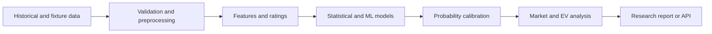

# Football Prediction Research

A portfolio project exploring football data pipelines, probabilistic match models, calibration, and expected-value analysis.

The repository contains two related experiments:

- `soccer-prediction/` — data collection, preprocessing, feature engineering, model training, prediction, and a FastAPI interface
- `value-bet-analyzer/` — probability normalization, market comparison, and configurable expected-value filters

## Engineering focus

- Reproducible data preparation across multiple leagues
- Feature construction from form, standings, goals, and Elo-style ratings
- Ensemble model experiments
- Poisson and Dixon-Coles score modeling
- Probability calibration
- Clear separation between model probability, bookmaker-implied probability, and decision thresholds
- Environment-based credentials and optional Telegram notifications



## Run locally

```bash
git clone https://github.com/louisoddie999/sports-prediction-bot.git
cd sports-prediction-bot
copy .env.example .env
python -m pip install -r soccer-prediction/requirements.txt
python soccer-prediction/test_setup.py
```

Add your own data-provider credentials to `.env`. Availability, rate limits, and schemas depend on the provider and may change.

## Evidence and limitations

The checked-in datasets and outputs are development fixtures for inspecting the pipeline. This public repository does not present a verified live accuracy, ROI, or profitability claim. Any model comparison should be reproduced with a time-aware holdout or walk-forward evaluation before conclusions are drawn.

## Responsible use

This project is for software-engineering and statistical-research purposes. Predictions are uncertain, can fail, and do not guarantee financial returns. Gambling involves financial risk; follow applicable laws and seek help if gambling becomes harmful.

## Author

[Louis Odiatu](https://www.linkedin.com/in/louis-odiatu) — AI Automation & Product Engineer
